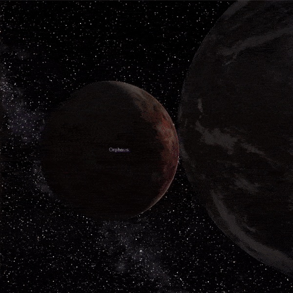

### Apie kosmosą

Jei kamuoja klausimai apie visatą ir norisi labiau pažinti kosmosą, štai keletas įdomių nuorodų:
    
* Rekomenduoju [Mokslo sriubą](https://www.youtube.com/user/mokslosriuba). Ten gausybė įdomiausių temų, įskaitant tokias, kaip [Apollo 11 skrydis į Mėnulį](https://www.youtube.com/watch?v=uEbGlIdV-7s) arba [JAV ir SSRS lenktynės](https://www.youtube.com/watch?v=iLMZD84Qf7k&t=11s)
* [Kelionė po visatą](https://www.youtube.com/watch?v=Afthg488n0E) beklausant techno garsų iš Jeff Mills albumo
* [Juodosios skylės vizualizacija](https://www.youtube.com/watch?v=8XEhtTr5Ud4)
* [Kassavaitinės naujienos](http://www.konstanta.lt/) astronominiuose atradimuose iš pirmų lūpų.
* [Celestia kompiuterinė programa](https://celestia.space/) ir [sutrumpinta instrukcija](Celestia/celestia.pdf), kaip ja naudotis.
* [Straipsnelis apie dangų](http://www.konstanta.lt/2019/12/skaitant-dangaus-zenklus-mokslo-populiarinimo-konkursas/)

Pabaigai - .gif iš mokslui pritaikytos Celestia versijos, kur parodytas Žemės susidūrimas su Tėja prieš 4,5 mlrd. metų. 
