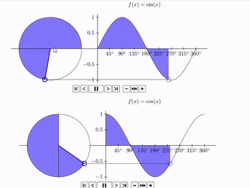

### Apie

Tai yra mokomoji medžiaga moksleivianms, padedanti mokytis trigonometriją nevadovėliniu būdu - pradedant nuo trigonometrinio skritulio sąvokos. Visa medžiaga ir uždaviniai savadarbiai, tekstas surinktas ir animacijos kurtos su *LATEX* programa. Turinys patalpintas faile **[trigonometrija.pdf](trigonometrija.pdf)**. Smagaus skaitymo!

### Kodėl verta failą atidaryti su Acrobat Reader?
Faile yra keletas animacijų, tokių kaip:

Jūsų naršyklėje jų nerodys. Jei norite kokybiško vaizdo, atsisiųskite failą į savo kompiuterį ir jį atidarykite per [Acrobat Reader](https://get.adobe.com/reader/) 

